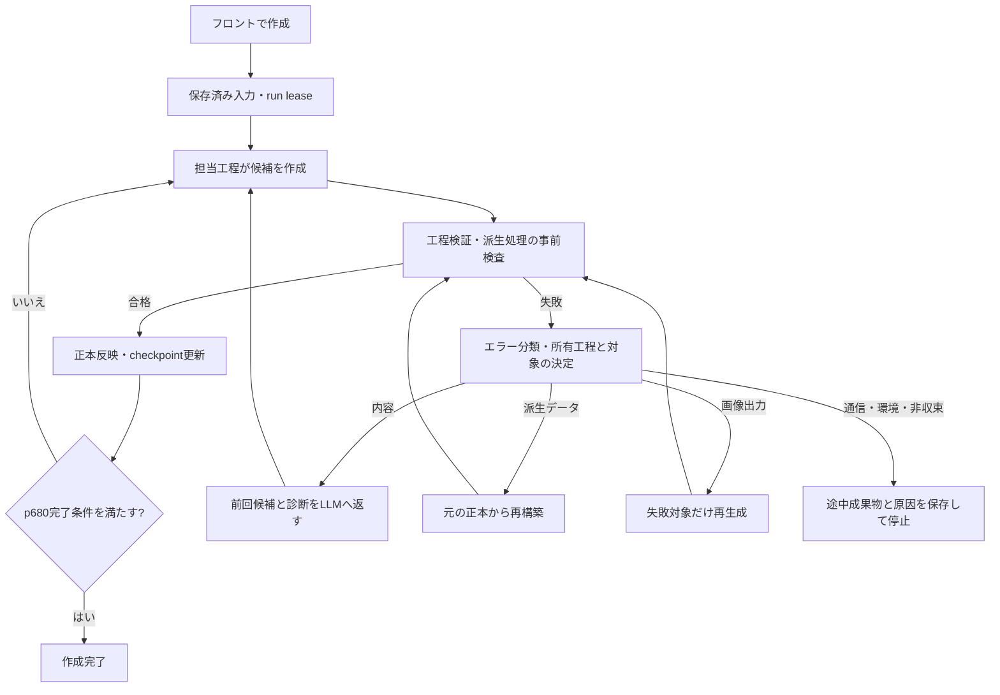

# フロント作成の自動補正設計

実装済みの範囲・具体化は `tasks.md` と `docs/implementation/production-auto-repair.md` を参照。以下は当初設計。実runの再開・外部画像生成はこの実装作業では行わない。

## 1. 方針

通常実行と補正実行を同じステージ実装に通す。検証器は問題の検出、補正ルーターは原因を所有する工程の選択、担当LLMは候補の修正、ステージ所有者は検証・正本反映を担当する。
補正用に別の物語生成パイプラインを作らず、現在のauthor関数へ前回出力と診断を渡す。
LLMは検証器・設定・コードを変更しない。正本ファイルへの書き込みは既存single-writerが行う。



## 2. 現状と変更点

| 所有工程 | 現在 | 導入する補正 |
|---|---|---|
| p120 research | 内容検証なし | そのまま維持。JSONの受信・保存失敗を内容検証に偽装しない |
| p220 architect | 構成案の不正で即停止 | 構成案と診断を同じarchitectへ返す。構成が確定するまでscene authorを開始しない |
| p220 scene author | シーンを特定できるエラーのみ補正、CLI既定12ラウンド | 現行の局所補正を共通の履歴・予算に統合。シーン特定不能なら診断によりarchitect/全体調整へ明示ルーティング |
| p220引き渡し | 追加の尺・時間帯検証で停止 | 追加検証をp220の候補検証へ集約し、同じ補正ループへ返す |
| p330 visual value | 検証失敗で停止 | シーン別の映像設計・Bロールを、失敗候補と診断付きで補正 |
| p420 cinematic direction | シーン別2回補正、最終検証で停止 | 最終検証・投影後検証も含める。カット/シーン/隣接境界を対象に補正 |
| p450 script/manifest投影 | 投影・preflight失敗で停止 | 派生処理のエラーなら再構築、著作内容のエラーならp420へ戻す |
| p500素材・p650画像リクエスト | 検証失敗で停止する経路あり | ID/参照/プロンプト診断を元のauthorへ返すか、既知の正本から再materialize |
| p660–p680画像生成・最終検証 | 既存の対象別生成・再開 | 欠損・デコード失敗の対象だけ再生成し、通常p680検証まで同じjobで継続 |

正しい日本語でも特定語句が必要な検証は、そのエラーだけでなく具体的な制約（例：必要な4ラベル）を補正入力に含める。
validatorの判定自体が誤っている場合は自動で検証を無効化せず、非収束診断として残す。

## 3. 共通診断

新規 `toc/production_diagnostics.py` に構造化した診断を定義する。

```json
{
  "schema_version": "toc.production_diagnostic.v1",
  "code": "cinematic.continuous_start_state_mismatch",
  "message": "前カット終了状態と次カット開始状態が一致しません",
  "detected_stage": "p450",
  "owner_stage": "p420",
  "category": "authoring",
  "artifact": "cinematic_direction.json",
  "selector": {"scene_id": "S03", "cut_id": "C02"},
  "path": "/scenes/2/cuts/1/start_state_facts",
  "expected": {"hand": "holding object"},
  "actual": {"hand": "empty"},
  "repair_action": "revise_scene",
  "validator_version": "...",
  "source_digest": "..."
}
```

- `category`: authoring / derived / media_output / transport / environment / policy / conflict / internal。
- コードと診断を発生元で付ける。例外型や英語エラー文言の部分一致だけで回復経路を決定しない。
- 既存validatorのerror keyは保持してアダプターで変換。selector不明を架空のsceneへ割り当てない。
- subprocessは `logs/repair/diagnostics/<attempt_id>.json` と結果ファイルのパスを返す。親はexit codeだけでなく構造化診断を読む。
- 任意のLLM応答・資料・providerエラーは信頼しないデータとして扱う。repair_action、path、対象scopeはコード側のregistryで決める。
- raw例外は診断ログに保持するが、鍵・認証情報・不要な環境変数をLLMやフロントへ渡さない。

## 4. 補正コンテキストとAPI

新規 `toc/production_repair.py` に共通budget/journal/ルーティングを置き、各ステージはadapterを提供する。
サーバーとsubprocessの双方で別の再試行ループを持たず、保存した共通の論理controllerとbudgetを使用する。

StageAdapterの責務:

- `generate(context, repair_context=None)`：既存authorを呼び候補を返す。
- `validate(candidate, inputs)`：元のvalidatorとその工程が所有する投影preflightを実行する。
- `repair_scope(diagnostics)`：修正対象と読み取り専用の隣接contextを決める。
- `publish(candidate)`：合格候補を既存のtransactionで反映する。
- `invalidate_dependents(changed_bindings)`：変更した内容に依存する成果物だけを無効化する。

RepairContext:

- 元の入力・ユーザー制約・モデル/生成設定、必要な正本資料。
- **直前の候補そのもの**、すべての未解決診断、試行番号、過去の修正要約。
- 修正可能なscene/cut/key、参照のみの前後シーン、禁止される上流変更。
- validator version、input/candidate digest、残り予算。
- 全資料を毎回複製せず必要なIDと近傍を含める。必要な依存が不足する場合は対象scopeを正式に拡張する。

局所補正→同じ工程のscene全体→隣接境界または構成案の補正、の順に範囲を拡張する。構成案を変えた場合はその構成に依存するシーンを再執筆し、古いIDやhandoffを流用しない。
不明な対象を推測して全runを最初から作り直す処理は禁止。

## 5. 修正する工程の決定

- 尺メタデータなどリクエストから一意に決まる技術値はコードで再設定。物語の内容や出来事はコードで創作しない。
- 時間帯・動作・人物状態・Bロールの記述はそれを執筆したp220/p330/p420へ戻す。
- 画像compilerのエラーは画像APIへ再送せず、入力となるfirst-frame planの所有者へ戻す。p420から投影された値ならp420を補正して再投影する。
- asset requestの不正はauthor所有のrequestを補正。素材画像の欠損はそのasset生成だけを実行する。
- 計画済みassetが無いときは架空の既存IDを作らず、既存asset追加・materialization経路で正式に作る。
- 古い派生snapshotは現在の正本から再構築する。未知の外部編集でhashが変わった場合は自動採用せずconflictとして停止する。
- 画像が壊れた/欠けた場合はcurrent requestの対象itemだけ再生成する。providerの応答が成功でも実ファイルの検証が通るまで完了にしない。
- providerによる拒否は通信と区別する。ポリシー回避のための自動言い換えはしない。生成設定の不正は既知の対応規則で直し、意図を変更しないと解消できない拒否は理由を表示する。
- p120へ内容検証を再導入しない。下流が必要とする情報不足は、まず下流authorが元のresearchから解決する。researchの改稿が不可欠なら対象外の上流変更として診断する。

## 6. 予算・非収束・エラー扱い

初期既定値（configで変更可能、run開始時に固定し保存）:

| 単位 | 既定値 |
|---|---|
| 同じ対象・同じscopeのLLM補正 | 3回、その後はscope拡張 |
| 1 authoring stageの補正 | 合計12回（scope拡張分を含む） |
| 1 runのLLM補正 | 合計40回 |
| 同一画像request digestの再生成 | 初回に加え2回 |
| 1 runの画像追加試行 | 必須画像item数×2回 |
| 同一入力での決定的再構築 | 1回。再現したら上流修正かinternal診断 |

初回生成・補正・既存ループの全呼び出しを記録し、入れ子ループによる上限の掛け算を禁止する。既存p220の12回/p420の2回は共通budgetへ移行する。
同じ候補digestと診断集合が2回連続したら同じscopeでの反復を止める。候補が変わっても同じ診断が3回続いたらscope拡張する。拡張先なし・予算終了・循環した上流修正は `repair_exhausted`。
LLMの修正回数だけで成功を判定しない。全件の検証結果と未解決diagnosticを残す。

transportは補正文脈へ流さず、既存の通信再試行方針があればその範囲内で適用し、尽きたら `transport_failed` とする。認証・quota・ストレージ・internal例外は専用理由で停止する。ユーザーcancelは最優先し、新しい補正呼び出しを開始しない。

## 7. 保存・再開・同時実行

`logs/repair/<stage>/<unit>/<attempt_id>/` に input、diagnostics、prompt、candidate、validation、result を保存する。source contentとerror messageはデータとして渡す。
`logs/repair/journal.jsonl` はappend-only。attempt開始前に予算を予約・記録する。中断時の外部呼び出し結果不明は、単純に予算未使用扱いへ戻さない。

処理順は候補生成→検証→publish準備journal→正本反映→checkpoint→job projection。
複数ファイルの正本反映には既存のバックアップ・publish journal・復旧処理を使い、ファイルごとのrenameだけで全体atomicと主張しない。
repair candidateは正本ではない。合格前の候補で現在の正本・完了画像を上書きしない。

- `StageCheckpoints` と既存create_input、run lease、run-root bindingを再利用する。
- validator/compiler versionと関連prompt contract versionをreceipt/repair bindingへ含める。
- 上流変更時は依存digestの変化から下流checkpointとrequestを無効化し、state.txtへdeltaを追加する。履歴は削除しない。
- 画像の再利用は存在だけでなくrequest/source/reference/provider provenance一致で判断する。
- 同一runに別のresume jobを自動POSTしない。実行中controllerが同じleaseを保有して次工程へ進む。
- 補正途中の手動resumeは拒否/既存jobへ誘導。停止後のresumeは保存済み入力・予算・最後の候補を再利用する。
- プロセス再起動後はlease解放と旧worker消滅を確認して復旧workerを1つ起動する。外部サービス障害で停止したjobを無制限に自動再開しない。
- provider完了が不明な呼び出しは照会APIが実在すれば確認。無ければexactly-once課金を保証しない。

## 8. フロント表示と完了判定

既存job statusの `running` を保ち、追加の `phase` で区別する:
`generating / validating / repairing / regenerating / finalizing`。
診断中・補正中の候補失敗をrun全体のFAILEDとして保存しない。終端失敗のみ既存failedへ写像し、failureKindを付ける。

追加フィールド:
`repairStage`, `repairTarget`, `repairAttempt`, `repairLimit`, `repairReason`, `completedImageCount`, `requiredImageCount`, `lastProgressAt`, `failureKind`。
表示例:「カット設計を補正中 — シーン3：前後の状態を調整（2/12）」。
内部stack traceは詳細ログへ残し、メイン表示は工程・原因・次の動作を示す。
同じエラーによる通知を反復しない。補正中もpollingを継続し、停止ボタンを有効にする。

最終p680検証の修正可能な失敗もcontrollerへ戻す。全必須画像が現在のrequestに対応し、通常の完了validatorが合格したときのみcompletedにする。
`stop_target=p650`、画像生成なし、取消はp680成功に変換しない。任意の候補選択・動画生成・公開は開始しない。

## 9. 実装配置

| ファイル | 変更 |
|---|---|
| 新規 `toc/production_diagnostics.py` | typed診断・エラー分類・既存validator変換 |
| 新規 `toc/production_repair.py` | 補正context、共通budget、journal、scope routing |
| `toc/story_author_pipeline.py` / story CLI | architect/sceneの補正、追加検証の統合 |
| `toc/visual_value_authoring.py` | p330候補保存・補正ループ |
| `toc/p400_authoring.py` / `toc/p400_projection.py` | 最終検証・投影・画像compiler診断のフィードバック |
| `scripts/toc-immersive-frontend-run.py` | ステージ境界の共通controller接続・中間FAILEDの抑制 |
| `server/image_gen_app.py` | 素材/画像itemと最終p680の補正接続・進捗projection |
| `toc/stage_checkpoints.py` / `toc/authoring_resume.py` | versionと補正journalを考慮した再開 |
| `server/web/src/main.tsx` と進捗型 | 補正中表示・終端理由 |

モデルは既存のGPT-6設定を継承。全体の物語判断はAstra、既存の限定修正担当は設定されたLunaを利用し、別世代への自動降格はしない。

## 10. 検証と導入

fake LLM/providerで失敗→診断入り補正→合格の経路を再現する。通信を伴うproduction runを単体テストに使わない。

必須ケース:

1. architect不正、scene不正、尺/時間帯不正、p330不正、p420最終不正のそれぞれが補正後に次工程へ進む。
2. 次のLLM入力が前の候補と実際のvalidator文言を含む。異なるモデル応答を返すだけの見かけのretryにしない。
3. 画像compiler失敗からp420補正→再投影→p650→画像生成まで完走する。
4. 画像1枚のデコード失敗はその1枚だけ再生成し、他画像のhashとprovider呼び出し回数は変わらない。
5. 同一エラー反復、未知例外、quota/認証/容量不足、policy拒否は適切な終端理由になり、無限ループしない。
6. 成功済み上流を変更しない補正、境界をまたぐ正当な補正、外部編集競合を区別する。
7. 各journal/publish/checkpoint境界で中断して再開しても、候補を成功扱いせず、予算がリセットされない。
8. cancel中の生成結果を記録してleaseを解放し、取消後のLLM/画像呼び出しは0件。
9. フロントの1回の作成操作から補正状態を経由してp680完了へ到達する統合/E2Eテスト。
10. p120検証が復活しない、p650停止・画像なしモード・対象外モードの挙動を維持する。

段階導入は診断とjournal→p220/p330/p420→p500/p650/p680→UI/E2Eの順。
全必須ケースを満たすまで「フロントから画像まで自動完走対応済み」と表示しない。既存runは履歴を移行せず、再開時に新しい補正journalを開始する。運用中runに設定を差し替えない。
