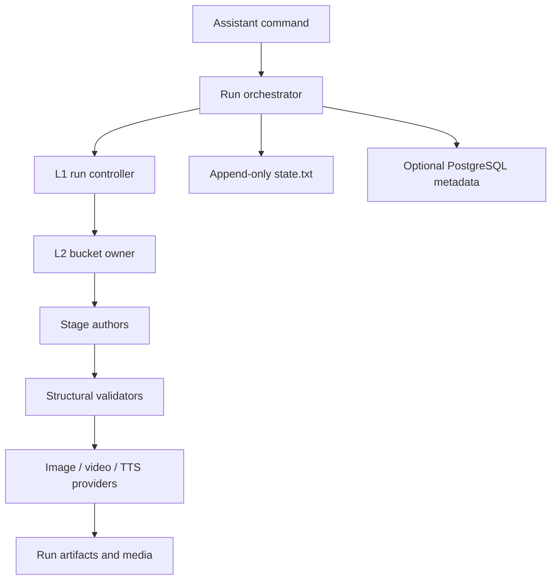

# System Architecture (MVP)

This document defines the local-first production architecture for the ToC pipeline.

## Scope and decisions

- The MVP runs on one local node and writes run artifacts under
  `output/<topic>_<timestamp>/`.
- LangGraph or an equivalent orchestrator may coordinate the stages. The contract is the
  artifact and state boundary, not a particular graph library.
- Filesystem storage is the artifact store. PostgreSQL is optional metadata storage.
- Provider adapters are replaceable: Codex built-in image generation, Kling/Seedance video,
  ElevenLabs TTS, and an LLM provider are the current defaults.
- State is an append-only `state.txt` log with derived current and navigation projections.
- Production is direct authoring → ordinary structural validation → generation. No production
  critic, evaluator, aggregator, score, or approval certificate is part of the execution path.

## Component diagram



## Execution model

The canonical order is:

```text
RESEARCH → STORY → VISUAL_PLANNING → SCRIPT → ASSET →
SCENE_IMPLEMENTATION → NARRATION → VIDEO → RENDER → QA
```

L1 resolves bucket order and stop targets. It checks the L2 result, required artifact paths,
ordinary structural validation, and terminal slot state. L1 does not interpret prose quality.

L2 owns one p100 bucket at a time and is the single writer for that bucket's canonical artifacts,
state updates, and navigation index. Isolated authors may write candidate or temporary files;
the L2 owner chooses the input to materialize and commits the canonical artifact.

Parallel workers are allowed within a stage after its input contract is complete. Asset, image,
and video fan-out is bounded and every result is bound to its request, item, input hashes,
destination, and provider output. A retry targets the smallest stale or failed item.

## Source context and validation

`workflow/stage-grounding.yaml` describes required documents, templates, and inputs. The stage
resolver prepares the source/readset; authors read it in the order
`global_docs → stage_docs → templates → inputs`. Readsets provide authoring context and are not
quality certificates.

Every author validates its output before handing it to the next stage:

- YAML/JSON/Markdown shape and required types
- unique IDs and valid source, selector, path, and handoff references
- scene/cut/event ordering and manifest consistency
- request snapshot, prompt/input hashes, provider settings, and reference bindings
- output existence, file type, decode, duration, and audio/video stream compatibility

These checks are ordinary data and media checks. They do not compute a quality score or require
an external verdict.

## Runtime boundary

`server/codex_app_server.py` is the shared boundary for app-server calls. It resolves the binary,
writable runtime home, output root, model, network settings, and diagnostics for CLI, server, and
frontend create. Transport/setup failure remains a runtime error and is never converted into a
content result. Built-in image output is copied only when its request-bound provenance tuple
matches the current snapshot.

The frontend create route invokes the same production helper as the command path. It records the
source bytes, source hash, topic, experience, target duration, and request identity before
authoring. It does not create a shortcut artifact or bypass structural and provenance checks.

## State management

`output/<run>/state.txt` is append-only. A transaction appends one delta event containing the
changed keys; the last committed value is current. `state.current.json`, `run_status.json`, and
`p000_index.md` are derived projections and can be rebuilt from the log. Shared state writers use
the repository lock/store API.

The state records stage and slot status, artifact paths, request revisions, source/input hashes,
provider provenance, and runtime errors. It does not require a separate production score,
certificate, or approval artifact to move between stages.

## Fixed p-slot contract

The coarse buckets remain p100 through p900. Review-only slots are retired from the active
contract. The active slots are:

| Bucket | Active slots | Responsibility |
| --- | --- | --- |
| p100 | p110, p120 | source context and research authoring |
| p200 | p210, p220 | source context and story authoring |
| p300 | p310, p330 | visual value authoring and handoff |
| p400 | p410, p420, p440, p450 | scene/cut authoring, human edits when supplied, skeleton manifest |
| p500 | p510, p520, p530, p550, p560, p570 | asset context, inventory, plan, requests, generation, ordinary continuity checks |
| p600 | p610, p620, p650, p660, p670, p680 | image context, prompt authoring, request readiness, generation, ordinary output checks, optional user selection |
| p700 | p710, p730, p740, p750 | narration authoring, TTS, measured duration, optional listening/selection |
| p800 | p810, p830, p840 | motion authoring, requests, video generation |
| p900 | p910, p920 | render inputs and final render/output checks |

`p410` and `p420` are authoring slots. The retired p130, p230, p320, p430, p435, p540, p630,
p640, p720, p820, p850, and p930 values are not generated as work slots. Old state history may
contain those names; current execution ignores them and does not synthesize a replacement pass.

Coarse targets resolve to the last active slot in that bucket:

```text
p100 → p120   p200 → p220   p300 → p330   p400 → p450   p500 → p570
p600 → p680   p700 → p750   p800 → p840   p900 → p920
```

## Supervisor handoff

Each bucket writes `logs/orchestration/pXXX.supervisor_result.json` with:

- `bucket`, `status`, `completed_slots`, `required_artifacts`, `state_keys`
- `next_bucket` or `blocked_reason`
- an optional ordinary `output_inventory`

The result confirms ownership, required files, state updates, and structural validation. It does
not contain critic reports, aggregate verdicts, quality scores, or approval evidence.

## Human choices and publishing

The UI may offer candidate selection, listening, editing, and explicit change requests. These are
stored as user actions and may change a request revision, which then triggers ordinary structural
and provenance validation. A user must explicitly authorize source hybridization and publication;
those decisions are separate from artifact generation and do not stand in for an automated
quality result.

## Module ownership

- `server/`: HTTP routes and runtime boundary
- `scripts/`: stage preparation, materialization, validation, and rendering helpers
- `toc/`: reusable contracts and projection/validation code
- `workflow/`: templates and state/slot contracts
- `docs/`: canonical design and operations documentation
- `output/`: run-local artifacts and media

## Configuration

`config/system.yaml` is the default source for local runtime settings. Environment variables may
override provider and concurrency values. Secret values are never written to prompts, manifests,
or source-readset artifacts.
